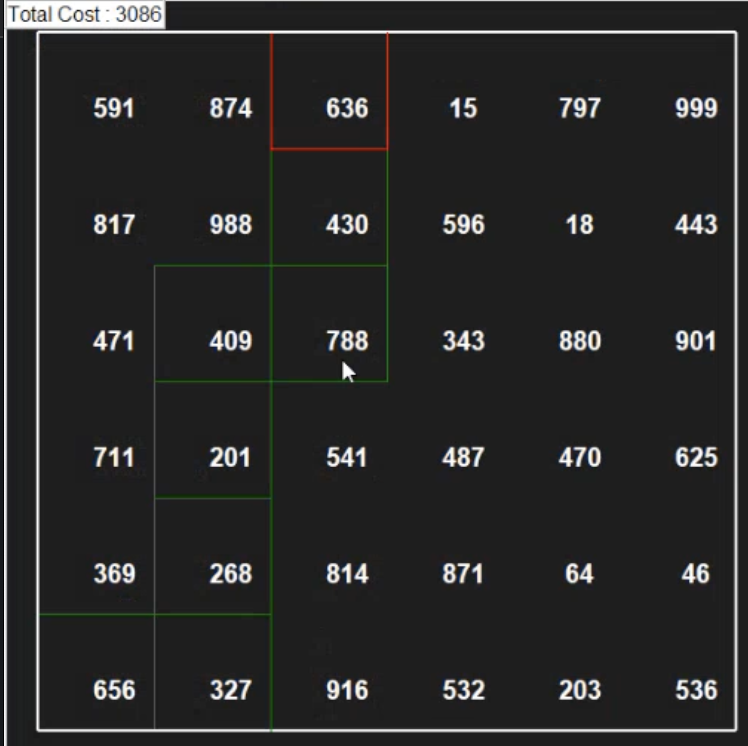
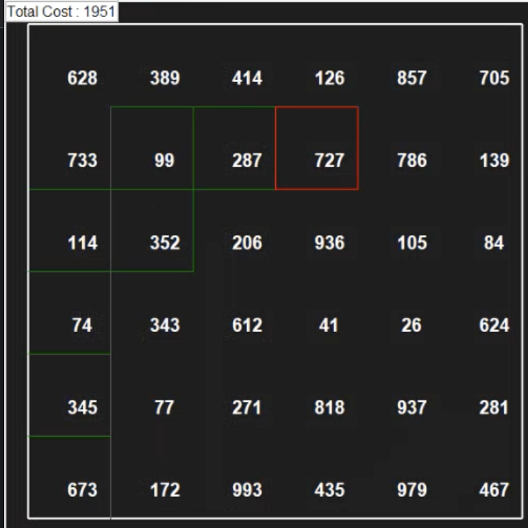

# Grafos2_Maze_Pathfinder

Tema:
 - Grafos2
 
# Caminho mais barato em custo 

## Alunos
|Matrícula | Aluno |
| -- | -- |
| 14/0146156 |  João Victor Lustosa Braz |
| 14/0155350  |  Matheus Filipe Faria Alves de Andrade |

## Sobre 
O projeto consiste em um programa que gera uma matriz onde os quadrantes da matriz possuem um valor numérico correspondente ao custo para chegar nessa casa. Dado um ponto inicial A e um ponto final B, o programa utiliza do algoritmo de Dijkstra para traçar o caminho com o menor custo possível entre A e B.

## Screenshots

## Instalação 
**Linguagem**: Python 

## Uso 
* cd pyamaze/Dijkstra\ Algorithm/  
* python3 dijkstraMaze.py

## Apresentação
O video da apresentação com a explicação do trabalho e sua execução se encontra no repositório.

